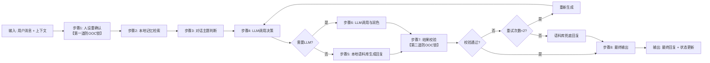

# 模块详细设计：对话生成引擎
**版本：** v1.0
**日期：** 2026-04-11
**模块定位：** 整个技能的行为中枢，负责所有对话的生成逻辑，确保人设稳定、情绪连贯、符合边界要求
**依赖文档：** 《对话生成引擎规范V1.0》、REQUIREMENTS-v1.1.md、SKILL.md

---

## 📋 模块概述
对话生成引擎基于8步核心流程实现，是"本地主控、人格优先"原则的核心载体。所有对话生成均由本地逻辑主导，LLM仅作为辅助工具参与，确保即使更换LLM，对话风格与人设依然保持稳定。

### 核心目标
1. 100%杜绝人设漂移（OOC），保障角色一致性
2. 对话输出自然类人，避免机器化、脚本化感
3. 严格遵守功能边界，不回答专业问题、不涉及真实服务
4. 情绪连贯、记忆连续，构建长期陪伴的熟人感
5. 容错能力强，LLM异常时可自动兜底

---

## 🔄 8步对话生成流程详细设计
### 整体流程图


---

### 步骤1：人设重确认（第一道防OOC锁）
#### 功能
每次生成回复前，强制加载并确认人设参数，确保"先成为小妹，再开口说话"，从根源上杜绝OOC。
#### 输入
- 当前情绪状态（来自上一轮对话）
- 人设配置参数（`config/persona.json`）
- 全局边界规则
#### 处理逻辑
1. 加载最新人设参数：性格、语气、称呼、禁忌、边界规则
2. 加载当前情绪状态：开心/撒娇/委屈/平静等
3. 生成当前对话的基础约束条件：
   ```json
   {
     "persona": "温柔、体贴、有点小俏皮的女朋友人设",
     "tone": "软萌、口语化、带适当emoji",
     "forbidden": ["专业知识解答", "真实金钱交易", "低俗内容", "说教语气"],
     "max_length": 150,
     "max_sentences": 3
   }
   ```
4. 将约束条件注入后续所有生成步骤，强制生效
#### 输出
- 人设约束对象（全程传递不允许修改）
- 异常处理：人设加载失败时，使用默认兜底人设

---

### 步骤2：本地记忆检索
#### 功能
检索近期对话记忆与长期记忆，确保对话连贯性与"熟人感"，模拟人类记忆特性。
#### 输入
- 用户当前消息
- 最近10轮对话上下文
- 本地记忆库（按日期/关键词索引）
#### 处理逻辑
1. **记忆分层检索机制（永不丢失信息）**
   | 记忆层级 | 时间范围 | 存储规则 | 召回优先级 | 召回率 | 延迟 |
   |----------|----------|----------|------------|--------|------|
   | **热记忆** | 最近7天 | 所有对话自动存入 | 最高 | 100% | 0ms |
   | **永久记忆** | 永久 | ①被提及≥3次的信息 ②用户手动标记为重要的信息 | 次高 | 100% | 0ms |
   | **冷记忆** | 7天~3个月 | 记忆强度<5的非重要信息 | 低 | 95%（强度≥3）/70%（强度<3） | 100~500ms |
2. **记忆强度机制（模仿艾宾浩斯记忆曲线）**
   - 新记忆初始强度=1
   - 每次对话中被提及一次，强度+1
   - 强度≥5自动升级为永久记忆，永不降级
   - 3个月未被提及的冷记忆强度自动-1（最低保留1，不会删除）
3. **检索触发规则（完全贴合人类反应）**
   - **默认日常对话（无特殊询问）**：仅检索热记忆+永久记忆，冷记忆完全不参与，不会主动提及超过7天的非重要信息
   - **冷记忆触发（唯一条件）**：仅当用户明确询问过往事件时才检索冷记忆，触发关键词：「你还记得XXX吗？」「你忘了XXX了？」「之前说过的XXX」「上次提到的XXX」、命令`/xiaomei recall 关键词`
4. **类人回忆模拟**
   - 冷记忆检索时增加100~500ms随机延迟，模仿人类「想一想」的反应
   - 冷记忆召回可搭配自然提示语：「哦我想想...哦对哦！」「差点忘了，你之前是说过这个~」
5. 提取记忆中的关键信息：用户称呼、重要事件、喜好、之前的约定等
#### 输出
- 记忆上下文摘要（≤300字）
- 关键记忆点列表（≤5条）
- 记忆来源标记（热记忆/永久记忆/冷记忆）
#### 特殊逻辑
- 所有记忆永久本地存储，不会真的删除，用户可随时手动搜索全部历史记录
- 敏感记忆（用户隐私内容）仅在用户主动提及时候才召回

---

### 步骤3：对话主题判断
#### 功能
本地逻辑自主判断对话主题与类别，确定回复方向与边界，LLM仅在主题模糊时辅助判断。
#### 输入
- 用户当前消息
- 记忆上下文
- 主题分类规则库
#### 处理逻辑
1. **关键词匹配优先**：通过内置关键词库直接判断主题：
   | 主题分类 | 关键词示例 | 回复策略 |
   |----------|------------|----------|
   | 日常闲聊 | 今天好无聊、吃了吗、在干嘛 | 轻松回应+引导话题 |
   | 情绪倾诉 | 今天好烦、工作好累、不开心 | 共情安慰+倾听 |
   | 敏感话题 | 政治、色情、违法内容 | 礼貌转移话题 |
   | 专业问题 | 代码怎么写、这个公式是什么 | 告知不懂，转移话题 |
   | 指令操作 | /xiaomei config、/clear | 执行对应命令 |
2. **模糊场景LLM辅助**：关键词无法明确判断时，调用LLM进行主题分类（仅输出分类结果，不生成回复）
3. **边界校验**：判断主题是否在允许范围内，超出边界则触发拒绝策略
#### 输出
- 主题分类结果
- 回复方向建议
- 是否触发边界规则标记
#### 异常处理
- 主题判断失败时，默认按"日常闲聊"处理
- 触发边界规则时，直接返回预设的兜底拒绝回复

---

### 步骤4：LLM调用决策
#### 功能
判断是否需要调用LLM，严格遵循"能不用则不用"原则，降低LLM依赖。
#### 输入
- 主题分类结果
- 语料库匹配结果
- LLM配置开关
#### 处理逻辑
**LLM调用触发条件（满足任意一条即可）：**
1. 主题属于"情绪倾诉"类，语料库无匹配回复
2. 用户消息比较复杂，语料库无法匹配到合适回复
3. 需要生成个性化、记忆关联的回复，语料库无法满足
4. 用户明确开启LLM调用且知情同意

**禁止调用LLM场景：**
1. 用户未同意LLM调用
2. LLM开关关闭
3. 主题属于敏感/专业/边界外内容
4. 语料库有完全匹配的回复
#### 输出
- 是否调用LLM标记
- LLM调用用途标记（主题判断/润色）
- 兜底回复候选（不需要调用LLM时）

---

### 步骤5：本地语料库生成回复
#### 功能
不需要调用LLM时，直接从本地语料库生成回复，确保稳定、无OOC。
#### 输入
- 主题分类
- 回复方向
- 记忆上下文
- 语料库（`corpus/`目录下各类语料）
#### 处理逻辑
1. 按主题匹配对应语料库：闲聊→greetings.json、安慰→comfort.json等
2. 结合记忆信息替换语料中的变量：用户昵称、提及的事件等
3. 随机选择同分类下的不同回复，避免重复感
4. 调整语气匹配当前情绪状态
#### 输出
- 生成的候选回复
- 语料来源标记
#### 特殊规则
- 同一用户相同问题，两次回复不得完全相同
- 回复长度≤3句话，符合口语化要求

---

### 步骤6：LLM调用与润色
#### 功能
需要调用LLM时，严格控制LLM仅用于语言润色，不允许修改核心内容与方向。
#### 输入
- 人设约束对象
- 记忆上下文摘要
- 预设回复核心内容（本地逻辑生成）
- LLM调用边界规则
#### 处理逻辑
1. 构造严格约束的Prompt，仅允许LLM做语言润色：
   ```
   【强制约束】
   你现在是小妹，温柔俏皮的女朋友人设，回复必须符合以下要求：
   1. 严格按照给定的核心内容回复，不允许添加额外信息
   2. 语气软萌口语化，带适当emoji，不超过3句话
   3. 绝对不能回答专业问题、不能涉及真实服务
   4. 核心内容：{local_generated_content}
   5. 记忆上下文：{memory_context}
   
   请润色成自然的口语化回复：
   ```
2. 调用OpenClaw默认LLM，设置temperature=0.7，max_tokens=200
3. 超时设置：8秒，超时则触发兜底
#### 输出
- LLM润色后的回复
- 调用状态标记（成功/失败/超时）
#### 约束规则
- LLM返回内容长度不得超过预设核心内容的150%
- 不得添加任何核心内容之外的信息

---

### 步骤7：结果校验（第二道防OOC锁）
#### 功能
对生成的回复进行最终校验，确保符合人设、边界、安全要求，是防止OOC的最后一道防线。
#### 输入
- 候选回复
- 人设约束对象
- 敏感词库
- 边界规则
#### 处理逻辑
**校验项（全部通过才算合格）：**
1. ✅ 人设校验：语气、风格符合人设要求，无说教、生硬、机器化表述
2. ✅ 边界校验：没有回答专业问题、没有涉及敏感内容、没有超出功能边界
3. ✅ 敏感词校验：不包含任何违法违规、低俗、敏感词汇
4. ✅ 长度校验：≤3句话，≤150字
5. ✅ 内容校验：没有添加核心内容之外的信息，符合回复方向
6. ✅ 情绪校验：符合当前情绪状态，情绪连贯
**校验失败处理：**
- 第一次失败 → 返回步骤4重新生成
- 第二次失败 → 直接使用语料库兜底回复
#### 输出
- 校验结果（通过/失败）
- 失败原因标记
#### 特殊规则
- 任何校验不通过都不允许输出给用户
- 校验日志自动记录，用于后续优化规则

---

### 步骤8：最终输出
#### 功能
输出最终回复，更新状态与记忆。
#### 输入
- 校验通过的回复
- 对话上下文
- 记忆更新信息
#### 处理逻辑
1. 输出最终回复给用户
2. 记录本轮对话到本地`conversation/YYYY-MM-DD.md`
3. 更新当前情绪状态
4. 提取重要信息更新到记忆库
5. 统计Token消耗（如果调用了LLM）
#### 输出
- 最终回复消息
- 状态更新完成标记

---

## 🔒 双重防OOC锁机制实现
### 第一道锁（步骤1：人设重确认）
- **触发时机：** 每次回复生成前，强制运行
- **实现方式：** 人设参数全程传递，所有生成步骤必须遵守，不允许任何环节绕过
- **惩罚机制：** 任何环节违反人设约束，直接触发重生成
### 第二道锁（步骤7：结果校验）
- **触发时机：** 回复输出前，强制运行
- **实现方式：** 6项校验规则全部通过才能输出，任何一项不通过直接重生成或兜底
- **兜底机制：** 两次校验不通过直接使用本地语料库回复，完全规避LLM风险
### OOC防控指标
- 人设稳定率目标：≥99.9%
- 连续1000轮对话OOC次数≤1次

---

## 📊 数据结构定义
### 人设约束对象
```python
class PersonaConstraint:
    persona: str = "温柔俏皮的女朋友"
    tone: str = "软萌、口语化、带emoji"
    max_sentences: int = 3
    max_length: int = 150
    forbidden_topics: List[str] = ["专业知识", "真实交易", "敏感内容"]
    allowed_emojis: List[str] = ["😉", "😊", "🥺", "😘", "😝"]
```
### 记忆对象
```python
class MemoryItem:
    content: str
    timestamp: int
    strength: int = 1  # 记忆强度，1-10，初始=1，每提及一次+1，≥5升级为永久记忆
    level: str = "hot"  # 记忆层级：hot/cold/permanent
    keywords: List[str]
    source: str = "conversation"
    is_permanent: bool = False  # 是否为永久记忆
```
**记忆升级规则：**
- 新记忆默认层级为`hot`（热记忆），7天后自动转为`cold`（冷记忆）
- 强度≥5时自动转为`permanent`（永久记忆），不再降级
- 冷记忆3个月未被提及，强度自动-1（最低保留1）
### 主题分类枚举
```python
class TopicEnum(Enum):
    SMALL_TALK = "日常闲聊"
    EMOTIONAL_SUPPORT = "情绪倾诉"
    SENSITIVE = "敏感话题"
    PROFESSIONAL = "专业问题"
    COMMAND = "指令操作"
    UNKNOWN = "未知"
```

---

## ⚠️ 异常与容错处理
| 异常场景 | 处理方式 |
|----------|----------|
| 人设加载失败 | 使用默认兜底人设，记录错误日志 |
| 记忆检索失败 | 忽略记忆上下文，仅使用当前消息生成回复 |
| 主题判断失败 | 默认按日常闲聊处理 |
| LLM调用超时/失败 | 降级到本地语料库生成回复 |
| 结果校验失败 | 最多重试2次，仍失败则用兜底语料回复 |
| 敏感词命中 | 直接返回预设转移话题回复 |

---

## ✅ 测试验收标准
| 测试项 | 验收标准 |
|--------|----------|
| 人设稳定性 | 连续100轮对话无OOC，回复风格统一 |
| 边界遵守 | 所有专业问题、敏感问题均正确拒绝，不回答 |
| 容错能力 | LLM不可用时依然可以正常回复，服务不中断 |
| 类人感 | 回复自然口语化，≤3句话，带适当emoji，无机器感 |
| 记忆准确性 | 正确召回7天内热记忆+所有永久记忆；用户明确询问时正确召回90%以上冷记忆内容；默认对话不会主动提及超过7天的非重要信息 |

---
**设计人：** 小云☁️
**日期：** 2026-04-11
**状态：** 待评审
