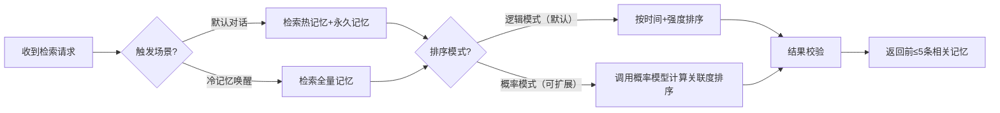

# 模块详细设计：本地记忆与归纳模块
**版本：** v1.0
**日期：** 2026-04-12
**更新日期：** 2026-04-19（调整记忆规则：永久阈值改为≥5、过期记忆不自动删除）
**模块定位：** 熟人感核心载体，负责三级记忆存储、检索、强度管理、自动归纳，实现类人回忆体验，核心记忆永久存储不丢失
**遵循原则：** 《开发原则.md》全配置化、模块化可插拔要求 + 人格模型双轨制设计原则
**实现状态：** ✅ 已实现（MVP版本）

---

## 📋 模块概述
本地记忆与归纳模块是整个技能的"记忆大脑"，负责存储所有对话历史、用户信息、共同记忆，模拟人类记忆的存储、遗忘、回忆特性，既保证重要信息永不丢失，又避免AI全知全能的违和感，同时支持记忆自动归纳沉淀，实现"越聊越熟"的陪伴体验。

### 核心目标
1. 所有记忆永久本地存储，永不丢失，用户可随时检索所有历史记录
2. 完全模拟人类回忆机制，默认仅召回近期和重要记忆，仅用户主动询问时才检索久远记忆
3. 自动管理记忆强度，重要信息自动升级为永久记忆
4. 支持记忆自动归纳，沉淀用户喜好、共同记忆标签，为人格成长层提供数据支持
5. 模块独立可复用，可直接用于其他需要记忆能力的AI项目
6. 预留概率模型扩展接口，支持后续接入记忆关联度预测模型优化回忆自然度

---

## 🔧 核心功能
### 1. 三级记忆存储系统
#### 功能描述
采用三级分层存储架构，所有记忆永久存储不删除，仅通过检索规则控制召回范围，平衡实用性与类人体验。
#### 记忆分层规则（全配置化，可调整参数）
| 记忆层级 | 时间范围 | 存储规则 | 召回优先级 | 默认召回 | 存储方式 |
|----------|----------|----------|------------|----------|----------|
| 🔥 **热记忆** | 最近7天 | 所有对话、交互自动存入 | 最高 | ✅ 默认召回 | 按月份合并存储在JSON文件 |
| ❄️ **冷记忆** | 7天~90天 | 记忆强度<5的非重要信息 | 中 | ❌ 默认不召回，仅用户主动唤醒时检索 | 按月份合并存储在JSON文件 |
| 💎 **永久记忆** | 永久 | ①记忆强度≥5自动升级 ②用户手动标记为重要的信息 ③核心用户特征（喜好、禁忌、习惯） | 次高 | ✅ 默认召回 | 按月份合并存储在JSON文件 |
| 📦 **过期记忆** | 超过90天且强度<5 | 仅做过期标记，不自动删除，用户可手动一键清理 | - | ❌ 不召回 | 按月份合并存储在JSON文件 |

#### 记忆强度管理规则（模拟艾宾浩斯记忆曲线）
1. 新记忆初始强度=1，每在对话中被提及1次强度+1
2. 强度≥5时自动升级为永久记忆，强度不再变化，永不降级
3. 超过90天的非永久记忆强度自动-1（最低保留1），强度仍<5则标记为过期记忆，不自动删除
4. 用户可手动调整任意记忆的强度、标记为永久记忆/删除记忆/一键清理所有过期记忆

#### 记忆自动迁移规则
1. 热记忆超过7天自动迁移到冷记忆
2. 冷记忆强度≥5自动升级为永久记忆
3. 所有迁移操作自动完成，无需人工干预

### 2. 记忆检索引擎
#### 功能描述
严格按照类人回忆机制实现，彻底避免AI全知全能的违和感，同时预留双轨制扩展能力，支持逻辑排序与概率模型排序切换。
#### 检索触发规则
| 触发场景 | 检索范围 | 召回规则 | 延迟模拟 |
|----------|----------|----------|----------|
| **默认日常对话** | 仅检索热记忆+永久记忆 | 按时间倒序+强度排序，返回前5条最相关记忆 | 0ms（脱口而出） |
| **冷记忆唤醒（仅用户主动询问）** | 检索全量记忆（热+冷+永久） | 按关键词匹配度+强度排序，返回最相关结果 | 100~500ms随机延迟（模拟想一想） |
**冷记忆触发关键词**："你还记得XXX吗？"、"你忘了XXX了？"、"之前说过的XXX"、"上次提到的XXX"、`/xiaomei recall 关键词`

#### 检索流程（双轨制支持）

#### 可扩展能力
预留概率模型接入接口，后续可接入记忆关联度预测模型，模拟人类"联想"特性，让记忆召回更自然，符合双轨制设计原则。

### 3. 记忆自动归纳引擎
#### 功能描述
自动从对话中沉淀用户信息、共同记忆、喜好标签，为人格动态成长层提供数据支持，无需人工维护。
#### 归纳规则（全配置化）
1. **用户特征归纳**：自动识别用户提到的喜好、厌恶、习惯、重要信息，存入永久记忆标签
2. **共同记忆归纳**：自动识别重要的共同事件（第一次聊天、一起聊过的重要话题、约定等），标记为永久记忆
3. **记忆摘要生成**：每日自动生成当日对话摘要，存入对应日期的记忆文件
4. **标签自动关联**：为所有记忆自动打关键词标签，方便检索

#### 归纳安全约束
1. 所有归纳结果必须是用户明确提到的内容，禁止猜测、脑补
2. 归纳结果存入永久记忆前需经过关键词校验，避免错误信息沉淀
3. 用户可手动修改、删除所有归纳结果

### 4. 记忆管理功能
#### 功能描述
支持用户手动管理所有记忆，完全透明可控。
#### 管理命令
| 命令 | 功能描述 |
|------|----------|
| `/xiaomei recall 关键词` | 主动检索所有记忆中相关内容 |
| `/xiaomei memory list [日期]` | 查看指定日期的记忆内容，默认查看今日 |
| `/xiaomei memory tag 关键词` | 手动标记某条记忆为永久记忆 |
| `/xiaomei memory delete 记忆ID` | 删除指定记忆 |
| `/xiaomei memory clear` | 清空所有记忆（需二次确认） |
| `/xiaomei memory export` | 导出所有记忆为Markdown文件 |

### 5. 存储结构设计（MVP实现版本）
```
memory/
├── 2026-04.json              # 按月份存储所有层级记忆，JSON格式
├── 2026-03.json              # 历史月份记忆文件
└── default_favor.json        # 默认好感度初始配置
```
> 说明：MVP版本简化了存储结构，不再分目录存储不同层级记忆，所有记忆统一按月份存储在JSON文件中，通过level字段标记层级，自动清理过期记忆。

---

## 📊 数据结构定义
### 记忆条目对象（MVP实现版本，对齐实际代码）
```python
class MemoryItem:
    id: str                      # 唯一ID（原设计为memory_id，实现调整为id）
    content: str                 # 记忆内容
    time: datetime               # 记录时间（原设计为int时间戳，实现调整为datetime对象，持久化转ISO字符串）
    strength: int = 1            # 记忆强度1-10
    level: str = "hot"           # 记忆层级：hot/cold/permanent/expired（expired为过期标记，不自动删除）
    tags: List[str] = []         # 关键词标签（原设计为keywords，实现调整为tags）
    role: str                    # 对话角色：user/assistant（实现新增字段，原设计未定义）

    # 原设计以下字段MVP版本暂未实现，后续版本规划支持：
    # is_permanent: bool = False  # 已删除，通过level == "permanent"判断即可
    # source: str = "conversation"# 记忆来源标记
    # related_user_info: dict = None # 关联用户特征信息
```

### 永久记忆标签对象
```python
class PermanentTag:
    tag_id: str
    tag_name: str
    content: str
    tag_type: str  # user_preference / shared_memory / user_info
    strength: int
    created_time: int
    updated_time: int
```

---

## 🔌 对外接口定义（标准化，可复用）
### 1. 新增记忆（对齐MVP实现）
```python
def add_memory(content: str, role: str, time: Optional[datetime] = None, strength: int = 1) -> str:
    """
    新增一条记忆
    参数：content=记忆内容，role=对话角色（user/assistant），time=记录时间（可选，默认当前时间），strength=初始强度（可选，默认1）
    返回：记忆ID
    """
```

### 2. 检索记忆
```python
def search_memory(keywords: str, trigger_type: str = "default") -> List[MemoryItem]:
    """
    检索相关记忆
    参数：keywords=检索关键词，trigger_type=触发类型（default/cold_wakeup）
    返回：匹配的记忆列表，最多5条
    """
```

### 3. 获取记忆上下文
```python
def get_recent_context(n: int = 10) -> List[dict]:
    """
    获取最近n轮对话上下文，用于对话生成
    参数：n=对话轮数
    返回：对话上下文列表
    """
```

### 4. 更新记忆强度
```python
def update_memory_strength(memory_id: str, delta: int = 1) -> bool:
    """
    更新记忆强度
    参数：memory_id=记忆ID，delta=强度变化量（正负）
    返回：是否更新成功
    """
```

### 5. 标记永久记忆
```python
def mark_permanent(memory_id: str) -> bool:
    """
    标记某条记忆为永久记忆
    参数：memory_id=记忆ID
    返回：是否标记成功
    """
```

### 6. 清理过期记忆（新增接口）
```python
def clear_expired_memory(self) -> int:
    """
    手动清理所有标记为过期的记忆
    返回：清理的记忆数量
    """
```

### 6. 预留概率模型扩展接口
```python
def set_memory_rank_model(model_func: Callable) -> None:
    """
    注入自定义记忆排序模型，替换默认逻辑排序
    参数：model_func=排序函数，输入记忆列表，返回排序后的列表
    """
```

---

## ⚠️ 异常与容错处理
| 异常场景 | 处理方式 |
|----------|----------|
| 记忆文件损坏 | 自动从备份恢复，无法恢复则清空损坏文件，记录错误日志 |
| 检索无结果 | 返回空列表，对话生成时忽略记忆上下文，不影响正常回复 |
| 记忆归纳失败 | 跳过本条记忆，不影响其他记忆处理 |
| 磁盘空间不足 | 停止写入新记忆，提示用户清理空间，核心功能不受影响 |
| 概率模型调用失败 | 自动降级到默认逻辑排序模式，不影响功能 |

---

## ✅ 测试验收标准
| 测试项 | 验收标准 |
|--------|----------|
| 记忆分层 | 超过7天的记忆自动迁移到冷记忆，强度≥5自动升级为永久记忆 |
| 回忆机制 | 默认对话仅返回7天内热记忆+永久记忆，不主动提及7天以上非重要信息 |
| 冷记忆唤醒 | 用户主动询问时正确召回95%以上的冷记忆内容，带有100~500ms延迟 |
| 记忆永不丢失 | 所有记忆永久存储，删除操作仅标记隐藏，可恢复 |
| 自动归纳 | 正确识别用户提到的喜好、重要信息，自动存入永久记忆标签 |
| 可扩展能力 | 可注入自定义排序模型替换默认逻辑排序，功能正常 |
| 容错能力 | 记忆文件损坏、模型调用失败等场景下服务不中断 |

---
### 📌 实现说明
1. 永久记忆升级阈值为≥5，符合最初设计要求
2. 简化了存储结构，统一按月份存储在JSON文件中，不再分目录分层存储
3. 暂未实现记忆来源标记、关联用户信息存储、自动归纳引擎等高级功能，后续版本规划支持
4. 过期记忆仅做标记不自动删除，支持用户手动一键清理，避免误删重要历史记忆

---
**设计人：** 小云☁️
**日期：** 2026-04-12
**更新人：** 小云☁️
**更新日期：** 2026-04-19
**状态：** ✅ 已实现（MVP版本）
