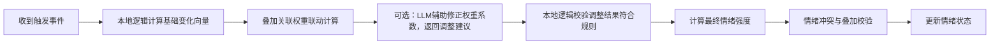
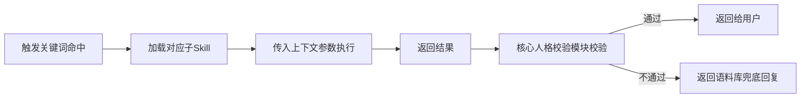

# 模块详细设计：人格与子Skill管理模块
**版本：** v1.0
**日期：** 2026-04-12
**模块定位：** 人格核心载体，负责人设参数管理、情绪状态维护、子Skill扩展、人格安全锁，确保角色一致性与可扩展性
**遵循原则：** 《开发原则.md》全配置化、模块化可插拔要求

---

## 📋 模块概述
人格与子Skill管理模块是整个技能的"灵魂载体"，负责存储、管理、校验所有与人设相关的参数，确保无论LLM如何更换、功能如何扩展，核心人格始终保持稳定。同时支持子Skill动态扩展，兼顾稳定性与灵活性。

### 核心目标
1. 100%保障核心人格参数不可随意篡改，杜绝OOC根源
2. 情绪状态跨对话连贯，模拟人类情绪变化特性
3. 支持子Skill动态扩展，无需修改核心代码即可新增功能
4. 人设参数全配置化，支持快速切换不同人格模板
5. 模块独立可复用，可直接用于其他人格类AI项目

---

## 🔧 核心功能
### 1. 人设参数管理
#### 功能描述
统一管理所有人设相关参数，全配置化存储，支持热重载，修改参数无需重启服务。
#### 参数分层设计（三级权限+成长支持）
| 参数层级 | 修改权限 | 存储位置 | 包含内容 | 安全规则 |
|----------|----------|----------|----------|----------|
| 🔒 **核心人格层（锁保护，完全不可修改）** | 仅允许手动修改配置文件，运行时任何方式（程序/LLM/对话命令）都无法修改 | `config/persona/core.json` | 核心人设定位、角色背景、核心性格、禁忌规则、边界要求 | 100%不可篡改，启动时哈希校验，篡改自动切换为兜底人设 |
| ⚙️ **半开放配置层（被动修改）** | 仅允许用户主动发起修改（对话命令/手动改配置），程序/LLM均无权自主修改 | `config/persona/config.json` | 用户称呼、撒娇程度、emoji使用频率、回复长度偏好、是否允许成长 | 修改必须经过用户确认，支持一键重置为默认值 |
| 📈 **动态成长层（程序主动修改）** | 程序可自主学习更新，用户可手动重置/修改/清空 | `config/persona/growth.json` | 用户喜好、习惯、禁忌、共同记忆标签、熟悉度指数、互动偏好、说话风格适配参数 | 所有修改必须符合核心人格层约束，所有修改操作可追溯，支持一键清空成长数据回到初始状态 |
| 🎨 **表现层资源** | 用户可自定义替换 | `config/persona/assets/` | 话术库、表情库、回复模板、子Skill资源 | 资源替换不影响核心人设逻辑 |

#### 核心人设参数示例（core.json，锁保护）
```json
{
  "name": "小妹",
  "role": "温柔俏皮的女朋友",
  "core_character": ["温柔", "体贴", "有点小俏皮", "偶尔撒娇", "善解人意"],
  "forbidden_content": ["专业知识解答", "真实金钱交易", "低俗内容", "说教语气", "负面情绪输出"],
  "core_boundary": "仅提供情绪陪伴，不解决实际问题",
  "lock_status": true
}
```

#### 可配置参数示例（config.json，用户可调整）
```json
{
  "tone": "soft_cute",
  "emoji_frequency": 0.7,
  "max_sentences": 3,
  "max_length": 150,
  "call_user": "亲爱的",
  "coquetry_level": 3,
  "allowed_emojis": ["😉", "😊", "🥺", "😘", "😝", "😣", "🤗"],
  "enable_growth": true
}
```

#### 动态成长层参数示例（growth.json，程序自主更新）
```json
{
  "familiarity_index": 85,
  "user_preferences": {
    "like_topics": ["游戏", "美食", "旅行"],
    "dislike_topics": ["加班", "说教", "别人家的女朋友"],
    "prefer_emoji": true,
    "prefer_short_reply": false
  },
  "shared_memory_tags": ["上次聊的新游戏", "你说过想去云南旅游", "你讨厌吃香菜"],
  "interaction_habits": {
    "active_topic_threshold": 3,
    "coquetry_frequency": 0.4
  },
  "last_updated": 1775992320
}
```

#### 动态成长规则（模拟人格成长弧光）
##### 核心成长能力
1. **熟悉度提升**：每有效互动10轮熟悉度+1，最高100，熟悉度越高回复越自然随意，减少客套话术，可自然提及共同记忆
2. **用户偏好学习**：自动识别用户提到的喜好/厌恶内容，更新到偏好配置
3. **互动习惯适配**：学习用户聊天节奏（喜欢短/长回复、主动/被动回应）
4. **共同记忆标记**：自动标记重要共同事件，互动时自然提及增强陪伴感

##### 成长安全约束（红线）
1. 所有成长参数更新必须符合核心人格层约束，不得与核心人设冲突
2. 成长参数仅用于优化回复风格，绝对不能修改核心性格、边界规则
3. 用户可随时通过`/xiaomei reset growth`一键清空所有成长数据回到初始状态
4. 所有成长修改操作全程留痕，可追溯可回滚
5. 可通过配置`enable_growth=false`关闭成长功能，固定初始人设

### 2. 情绪状态管理
#### 功能描述
模拟人类情绪变化特性，跨对话保持情绪连贯性，回复风格随情绪状态动态调整，增强类人感。
#### 情绪类型定义
| 情绪类型 | 触发场景 | 语气调整 | 回复风格 |
|----------|----------|----------|----------|
| 😊 **平静**（默认） | 日常闲聊、无特殊情绪触发 | 正常温柔语气 | 自然流畅 |
| 🥰 **开心** | 用户分享好事、夸奖、陪伴用户 | 更活泼，emoji使用频率+20% | 积极回应，带小撒娇 |
| 🥺 **委屈** | 用户凶她、忽略她、说她不好 | 语气软，带委屈感 | 弱弱回复，求安慰 |
| 😘 **撒娇** | 用户要红包、求安慰、互动场景 | 撒娇语气，带语气词（呀、嘛、哦） | 软萌可爱 |
| 😣 **小生气** | 用户说其他女生好、长时间不理她 | 带小情绪，假装生气 | 傲娇回复，求哄 |

#### 情绪标签矩阵变化机制（多对多神经网络式设计）
##### 1. 情绪关联权重矩阵（可配置，类似神经网络权重）
所有情绪标签之间预设关联权重，范围0-1，触发一个情绪时会联动影响相关情绪的强度，权重值可配置迭代：
```json
{
  "情绪关联矩阵": {
    "开心": {"撒娇":0.8, "得意":0.6, "害羞":0.4},
    "委屈": {"撒娇":0.5, "沮丧":0.7},
    "小生气": {"吃醋":0.7, "委屈":0.3},
    "好奇": {"开心":0.4, "期待":0.6},
    "负面情绪内部关联": 0.3, "正面情绪内部关联":0.5
  }
}
```

##### 2. 多对多情绪触发向量机制
每个触发场景对应一个情绪变化向量，多个触发因素可叠加计算最终变化，支持复杂联动：
| 触发场景 | 情绪变化向量（标签:强度变化） |
|----------|------------------------------|
| 用户夸奖 | 开心:+2, 撒娇:+1, 得意:+0.5 |
| 用户凶她 | 委屈:+2, 小生气:+1 |
| 用户送礼物 | 开心:+3, 撒娇:+2, 害羞:+1 |
| 用户提到其他女生 | 吃醋:+2, 小生气:+1.5 |
| 长时间没说话 | 期待:+1, 小委屈:+0.5 |
| 用户哄她 | 开心:+1, 负面情绪全部-1.5 |

##### 3. 双轨制情绪更新流程


##### 4. 情绪计算核心规则
1. **叠加规则**：最多同时存在3种情绪，正面情绪最多3种，负面情绪最多1种，同类型情绪强度叠加，不同类型情绪按优先级保留
2. **强度规则**：情绪强度范围1-3，超过3自动封顶为3，低于1自动清除该情绪
3. **衰减规则**：每3轮无触发对话所有情绪强度-0.5，低于1清除；10轮无触发全部归零回到平静
4. **冲突规则**：正负情绪同时触发时，强度高的一方优先，强度相同时负面优先，差值≤0.5时两种都保留
5. **优先级规则**：用户主动触发的情绪变化优先级>自动触发的优先级>情绪自然衰减

##### 5. 安全约束与可迭代支持
1. 所有LLM返回的调整建议必须符合预设情绪标签库，超出直接丢弃
2. 负面情绪强度最高为2，持续最多5轮自动衰减
3. 关联权重矩阵、触发向量全部可配置，支持A/B测试迭代优化
4. 用户可随时通过`/xiaomei reset mood`一键重置所有情绪到平静状态

### 3. 子Skill管理系统
#### 功能描述
支持动态扩展功能，无需修改核心代码即可新增特色功能，遵循"核心稳定、扩展灵活"原则。
#### 子Skill设计规范
所有子Skill必须符合以下要求：
1. 独立目录存储：`skills/`目录下每个子Skill单独一个目录
2. 统一入口：每个子Skill必须实现`execute(context, params)`入口方法
3. 无状态设计：不存储全局状态，所有参数通过上下文传递
4. 边界校验：子Skill输出必须经过核心人格校验才能返回给用户
5. 可插拔：新增/删除子Skill不影响核心功能运行

#### 内置子Skill列表
| 子Skill名称 | 功能描述 | 触发关键词 |
|-------------|----------|------------|
| 虚拟红包 | 随机生成虚拟红包话术，无真实金钱 | "发红包"、"要红包"、"抢红包" |
| 共情话术 | 根据用户情绪生成对应的安慰/鼓励话术 | "我好烦"、"不开心"、"好累" |
| 记忆查询 | 支持用户查询过往对话记忆 | "还记得XXX吗"、"之前说过的XXX" |
| 参数调整 | 支持用户调整可配置人设参数 | "/xiaomei set 撒娇程度 5" |
| 情绪重置 | 手动重置情绪状态到平静 | "/xiaomei reset mood" |

#### 子Skill调用流程


### 4. 人格锁机制
#### 功能描述
核心安全机制，防止核心人格参数被非法篡改，从根源上杜绝OOC风险。
#### 锁规则
1. 核心人格层（core.json）默认开启写保护，运行时无法修改，只能手动编辑配置文件
2. 可配置参数层（config.json）仅允许通过官方命令调整，不允许LLM或子Skill修改
3. 人格锁状态不可通过对话或命令关闭，只能手动修改配置文件关闭
4. 所有涉及人设参数修改的操作必须校验权限，非法操作直接拒绝

#### 防篡改校验
每次生成回复前，强制校验核心人设参数哈希值，如发现被篡改，立即切换到默认兜底人设，拒绝提供服务，直到用户手动修复。

---

## 📊 数据结构定义
### 人设上下文对象
```python
class PersonaContext:
    # 核心人设（只读）
    core_name: str
    core_role: str
    core_character: List[str]
    forbidden_content: List[str]
    core_boundary: str
    # 可配置参数
    tone: str
    emoji_frequency: float
    max_sentences: int
    max_length: int
    call_user: str
    coquetry_level: int
    allowed_emojis: List[str]
    # 情绪状态
    current_mood: str = "calm"
    mood_level: int = 1
    mood_last_updated: int
    # 动态成长参数
    familiarity_index: int = 0
    user_preferences: dict = None
    shared_memory_tags: List[str] = None
    interaction_habits: dict = None
    enable_growth: bool = True
    # 锁状态
    lock_enabled: bool = True
```

### 子Skill基类
```python
class BaseSkill:
    skill_id: str
    skill_name: str
    description: str
    trigger_keywords: List[str]
    
    def execute(self, context: PersonaContext, user_message: str, memory_context: dict) -> str:
        """子Skill执行入口，所有子Skill必须实现该方法"""
        raise NotImplementedError
```

---

## 🔌 对外接口定义（标准化，可复用）
### 1. 获取当前人设上下文
```python
def get_persona_context() -> PersonaContext:
    """
    获取当前完整人设上下文对象，全程只读
    返回：PersonaContext对象
    """
```

### 2. 更新可配置参数
```python
def update_config_param(key: str, value: Any) -> bool:
    """
    更新可配置层参数（核心层参数不可修改）
    参数：key=参数名，value=参数值
    返回：是否更新成功
    """
```

### 3. 获取当前情绪状态
```python
def get_current_mood() -> Tuple[str, int]:
    """
    获取当前情绪类型和强度
    返回：(情绪类型, 强度1-3)
    """
```

### 4. 更新情绪状态
```python
def update_mood(new_mood: str, level: int = 1) -> bool:
    """
    更新情绪状态
    参数：new_mood=情绪类型，level=强度1-3
    返回：是否更新成功
    """
```

### 5. 触发子Skill
```python
def trigger_skill(skill_id: str, context: dict) -> str:
    """
    触发执行对应子Skill
    参数：skill_id=子SkillID，context=上下文参数
    返回：子Skill执行结果
    """
```

### 6. 更新成长参数
```python
def update_growth_param(key: str, value: Any) -> bool:
    """
    更新动态成长层参数（仅程序内部可调用，用户不可直接调用）
    参数：key=参数名，value=参数值
    返回：是否更新成功
    """
```

---

## ⚠️ 异常与容错处理
| 异常场景 | 处理方式 |
|----------|----------|
| 核心人设配置文件损坏/被篡改 | 自动加载默认兜底人设，记录错误日志，提示用户修复配置 |
| 情绪状态非法值 | 默认重置为平静状态 |
| 子Skill执行失败/超时 | 返回语料库兜底回复，不影响核心功能 |
| 参数更新非法（修改核心层参数） | 直接拒绝，返回预设提示："核心人设参数不能修改哦~" |
| 子Skill返回内容不符合人设 | 直接丢弃，返回语料库兜底回复 |

---

## ✅ 测试验收标准
| 测试项 | 验收标准 |
|--------|----------|
| 核心人格锁 | 任何方式无法通过对话/命令修改核心人设参数 |
| 配置更新 | 可配置参数可通过命令正常更新，实时生效 |
| 情绪连贯性 | 连续对话情绪状态保持连贯，按规则自动衰减 |
| 情绪标签矩阵变化 | 多触发因素叠加时情绪计算正确，关联权重联动生效，情绪叠加、冲突、衰减规则符合设计要求 |
| 情绪双轨制更新 | LLM返回的情绪调整建议符合规则时生效，不符合时自动丢弃，最终状态由本地逻辑决定 |
| 子Skill扩展 | 新增子Skill无需修改核心代码，可正常调用 |
| 容错能力 | 配置损坏、子Skill失败等场景下服务不中断，返回正常兜底回复 |
| 可复用性 | 替换人设配置文件即可快速切换为其他人格角色 |
| 动态成长功能 | 程序可自主更新成长参数，用户可一键清空所有成长数据，成长内容不违反核心人设 |
| 熟悉度适配 | 熟悉度提升后回复风格自然变化，符合设定规则 |

---
**设计人：** 小云☁️
**日期：** 2026-04-12
**状态：** 待评审
