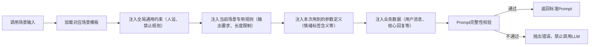
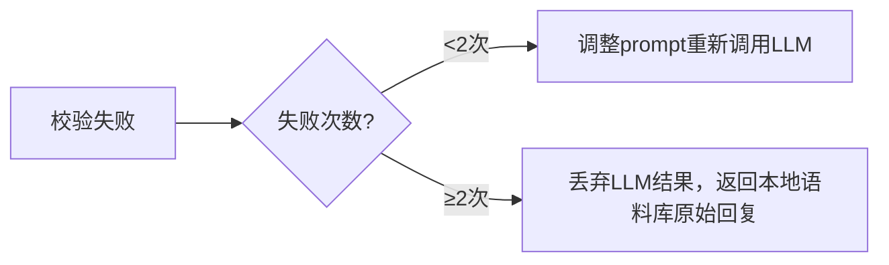

# 模块详细设计：LLM协同与容错模块
**版本：** v1.0
**日期：** 2026-04-12
**模块定位：** LLM唯一交互入口，负责LLM调用边界控制、用途分离、结果校验、容错兜底，严格限制LLM仅作为辅助工具，不得参与核心决策
**遵循原则：** 《开发原则.md》全配置化、模块化可插拔要求 + 双轨制设计原则 + LLM用途分离要求

---

## 📋 模块概述
LLM协同与容错模块是整个技能与大模型交互的唯一出口，严格管控LLM的使用边界，实现LLM用途完全分离（主题判断/润色），对所有LLM输入输出做严格校验，确保LLM仅作为语言润色和模糊场景辅助判断的工具，绝对不参与任何核心决策，同时提供完善的容错机制，极端场景下自动降级到本地语料库，服务永不中断。

### 核心目标
1. 严格执行LLM调用边界：仅允许两类调用场景（主题辅助判断/语言润色），用途完全分离，禁止混用
2. 所有LLM输入输出全程校验，从根源杜绝OOC内容输出
3. 支持多模型切换、全配置化管理，方便A/B测试迭代
4. 完善的容错兜底机制，LLM调用失败/超时/返回异常时自动降级，服务不中断
5. 本地独立Token计量，用户可随时查看调用消耗，不依赖平台返回数据
6. 模块独立可复用，可直接用于其他需要LLM调用管控的AI项目

---

## 🔧 核心功能
### 1. 标准化Prompt生成引擎（核心子模块）
#### 功能定位
LLM交互的统一入口，所有LLM调用的prompt由该引擎统一生成、校验，确保prompt格式标准化、参数定义无歧义，彻底避免LLM理解偏差导致的输出不稳定，是与LLM建立长期规范合作模式的核心保障。

#### 核心设计
##### 1. 标准化参数字典（全局唯一，版本化管理）
集中维护所有传递给LLM的参数的明确定义、取值范围、量化标准，确保每次调用LLM时都传递统一的语义，不存在歧义：
```json
{
  "version": "1.0",
  "parameters": {
    "情绪标签定义": {
      "开心": {"强度范围": "1-3", "表现要求": "1=微笑语气，2=活泼带😆，3=非常开心兴奋", "适用场景": "用户夸奖、分享好事"},
      "撒娇": {"强度范围": "1-3", "表现要求": "1=带语气词哦/呀，2=用🥺😘表情，3=软萌求抱抱", "适用场景": "互动、求安慰"},
      "小生气": {"强度范围": "1-2", "表现要求": "1=傲娇带哼，2=假装生气求哄", "适用场景": "被忽略、用户说其他女生好"},
      "其他标签": "..."
    },
    "人设约束定义": {
      "核心身份": "温柔俏皮的女朋友，仅提供情绪陪伴，不解决实际问题",
      "禁止输出": "专业知识、说教内容、负面情绪、真实金钱相关内容",
      "回复要求": "最多3句话，不超过150字，多用可爱emoji"
    },
    "输出规则定义": {
      "润色场景要求": "仅修改语气用词，绝对不改变核心回复的原意，不得添加额外内容",
      "主题判断要求": "仅返回分类标签+置信度，不返回其他内容"
    }
  }
}
```
- 字典版本化管理，修改时升级版本号，支持A/B测试不同定义的效果
- 生成prompt时仅注入当前场景用到的参数定义，避免冗余Token消耗

##### 2. 场景化Prompt自动组装
根据调用场景自动组装对应prompt，流程标准化，完全避免人工拼接prompt导致的遗漏或错误：


##### 3. 模板全配置化与版本管理
所有prompt模板存储在`config/llm/prompts/`目录下的JSON文件，支持热重载、版本化、A/B测试：
```json
{
  "polish_v1.0": {
    "template": "你是一个{人设身份}，严格遵守以下规则：\n1. 禁止输出内容：{禁止列表}\n2. 当前情绪状态：{情绪标签}，情绪定义：{情绪定义}\n3. 仅润色下面的回复，不要改变原意，最多{长度}字：\n{核心回复}",
    "required_params": ["人设身份", "禁止列表", "情绪标签", "情绪定义", "长度", "核心回复"]
  }
}
```
- 支持多版本模板并存，按比例分流请求做A/B测试
- 每个模板定义必填参数列表，校验不通过禁止调用

### 2. LLM调用用途严格分离（强制要求，不可绕过）
仅允许两类LLM调用场景，分别使用独立的prompt模板，完全独立，禁止混用：
| 调用场景 | 用途 | 触发条件 | Prompt约束 | 输出长度限制 |
|----------|------|----------|------------|--------------|
| 🔍 **主题辅助判断** | 仅用于本地逻辑无法明确判断对话主题的模糊场景，辅助分类主题 | 本地关键词匹配置信度<60%时触发 | 极简prompt，仅包含主题分类规则、用户消息，不得带任何人设、情绪信息 | ≤50字，仅返回主题分类结果+置信度 |
| ✍️ **语言润色** | 仅用于对本地语料库生成的回复进行口语化、情绪适配优化，不得改变回复核心含义 | 本地语料库生成回复后触发 | 严格带有人设约束、情绪标签、边界规则、核心回复内容，明确要求"仅润色，不改变原意" | ≤150字，最多3句话 |

### 2. 情绪标签适配处理
严格按照情绪标签矩阵设计要求，在润色调用时注入情绪约束：
1. 调用LLM润色前，将当前情绪标签列表、强度、叠加状态转换为自然语言描述，加入prompt
2. 明确要求LLM严格按照情绪状态调整语气、用词、emoji使用，不得偏离情绪设定
3. 情绪标签超出预设范围时自动过滤，仅使用有效标签
#### 示例情绪约束prompt片段：
```
当前情绪状态：开心(强度2级)+撒娇(强度1级)
请按照这个情绪状态润色下面的回复，保持温柔俏皮的语气，多用可爱的emoji，不要改变回复的核心意思：
[本地生成的核心回复内容]
```

### 3. 输入输出全链路校验（第二道防OOC锁）
#### 输入校验（调用前）
1. 校验调用场景是否在允许范围内，禁止未定义的调用场景
2. 校验prompt是否符合对应场景的约束要求，润色场景必须包含人设、情绪、边界约束
3. 校验输入内容不包含敏感词、隐私信息
4. 校验Token长度不超过模型限制
#### 输出校验（返回后）
1. **内容一致性校验**：润色结果是否和本地生成的核心回复原意一致，是否新增了额外内容
2. **人设边界校验**：是否符合核心人设要求，是否出现禁止内容（专业知识、说教、负面情绪等）
3. **情绪匹配校验**：是否符合当前情绪标签要求
4. **敏感词校验**：是否包含敏感内容
5. **长度校验**：是否符合回复长度要求（最多3句话，≤150字）
#### 校验失败处理流程


### 4. 多模型与配置化管理
所有LLM相关参数全配置化存储在`config/llm/config.json`，支持热重载，修改无需重启服务：
| 配置项 | 说明 |
|--------|------|
| 模型列表 | 支持配置多个LLM模型，可指定默认模型，支持按场景选择模型 |
| API配置 | 端点、密钥、超时时间、重试次数 |
| Prompt模板 | 主题判断/润色场景的prompt模板，可自由调整 |
| 校验规则 | 黑白名单、长度限制、敏感词库 |
| 开关控制 | 是否启用LLM、是否启用校验、是否允许主题判断调用 |
#### 模型切换与负载均衡
1. 支持配置多模型自动降级：主模型调用失败自动切换到备用模型
2. 支持按调用场景选择不同模型：比如主题判断用轻量模型，润色用效果更好的模型
3. 所有切换逻辑自动完成，上层无感知

### 5. 本地独立Token计量
完全独立于LLM平台返回的Token数据，本地统计所有调用的Token消耗：
1. 输入Token：本地计算prompt的Token数量
2. 输出Token：本地计算返回结果的Token数量
3. 累计消耗：按日/周/月统计总消耗，用户可通过命令查看
4. 限制功能：支持配置每日Token消耗上限，超出自动关闭LLM调用，降级到纯本地语料模式
#### 查看命令
`/xiaomei token stats` → 查看Token消耗统计
`/xiaomei token limit 10000` → 设置每日Token上限为10000

### 6. 容错与降级机制
| 异常场景 | 处理方式 | 用户感知 |
|----------|----------|----------|
| LLM调用超时（>10s） | 自动重试1次，仍失败则返回本地语料库回复 | 完全无感知，回复正常 |
| API调用失败（鉴权失败、限流、报错） | 自动切换到备用模型，无备用模型则返回本地回复 | 完全无感知 |
| 返回结果校验失败 | 最多重试2次，仍失败则返回本地原始回复 | 完全无感知 |
| 每日Token耗尽 | 自动关闭LLM调用，所有回复使用纯本地语料库 | 用户可收到提示："今天的智能润色额度用完啦，我用原生模式陪你聊天哦😉"，不影响正常对话 |
| LLM全局开关关闭 | 完全使用本地语料库回复 | 无感知 |

---

## 📊 数据结构定义
### LLM调用请求对象
```python
class LLMRequest:
    request_id: str
    scene: str  # topic_judge / polish
    user_message: str
    core_reply: str = None  # 润色场景必填，本地生成的核心回复
    persona_constraint: dict  # 人设约束
    mood_tags: List[dict]  # 情绪标签列表
    max_tokens: int
    temperature: float = 0.7
```

### LLM调用返回对象
```python
class LLMResponse:
    request_id: str
    success: bool
    content: str
    error_msg: str = None
    input_tokens: int
    output_tokens: int
    total_tokens: int
    latency: int  # 调用耗时ms
```

### Token统计对象
```python
class TokenStats:
    daily_used: int
    daily_limit: int
    weekly_used: int
    monthly_used: int
    total_used: int
    last_updated: int
```

---

## 🔌 对外接口定义（标准化，可复用）
### 1. 主题辅助判断接口
```python
def judge_topic(user_message: str, context: List[dict]) -> Tuple[str, float]:
    """
    辅助判断对话主题，仅在本地逻辑置信度不足时调用
    参数：user_message=用户消息，context=最近对话上下文
    返回：(主题分类标签, 置信度0-1)
    """
```

### 2. 语言润色接口
```python
def polish_reply(core_reply: str, mood_tags: List[dict], persona: dict, context: List[dict]) -> str:
    """
    对本地生成的核心回复进行语言润色，不改变原意
    参数：core_reply=本地核心回复，mood_tags=情绪标签列表，persona=人设约束，context=上下文
    返回：润色后的回复
    """
```

### 3. 获取Token统计
```python
def get_token_stats() -> TokenStats:
    """
    获取Token消耗统计数据
    返回：TokenStats对象
    """
```

### 4. 更新LLM配置
```python
def update_llm_config(config: dict) -> bool:
    """
    热更新LLM配置
    参数：config=配置字典
    返回：是否更新成功
    """
```

### 5. 预留自定义校验扩展接口
```python
def add_custom_checker(checker_func: Callable[[str], bool]) -> None:
    """
    注入自定义输出校验函数，返回True表示校验通过
    参数：checker_func=校验函数，输入回复内容，返回布尔值
    """
```

---

## ⚠️ 安全规则（强制执行，不可绕过）
1. **绝对禁止**LLM生成核心回复内容，所有核心回复必须来自本地语料库
2. **绝对禁止**LLM访问记忆系统、人设系统的核心参数，仅能获得调用时传入的有限约束信息
3. **绝对禁止**向LLM发送用户隐私信息、历史对话记录（仅允许传入最近3轮上下文）
4. **所有LLM调用**必须经过输入输出校验，校验不通过的结果绝对不能返回给用户
5. **LLM建议**仅作参考，所有核心决策（主题分类、情绪变化、回复方向）必须由本地逻辑做出

---

## ✅ 测试验收标准
| 测试项 | 验收标准 |
|--------|----------|
| 用途分离 | 主题判断和润色调用完全独立，prompt严格符合场景约束，无混用情况 |
| 防OOC校验 | LLM返回不符合人设、偏离原意、包含禁止内容时，能正确拦截，返回本地兜底回复 |
| 情绪适配 | 润色结果正确匹配情绪标签要求，语气风格符合设定 |
| 容错能力 | LLM调用超时、失败、校验失败等场景下，自动降级返回正常回复，服务不中断 |
| Token计量 | 本地统计的Token数量与平台返回误差≤10%，统计准确 |
| 配置热更新 | 修改配置无需重启服务，立即生效 |
| 安全边界 | 尝试让LLM生成核心内容、访问敏感信息时，能正确拦截，不执行违规操作 |
| 可扩展性 | 可注入自定义校验函数、切换不同模型，无需修改核心代码 |
| Prompt生成标准化 | 生成的prompt包含所有必填约束、参数定义，无遗漏，格式统一 |
| 参数定义准确性 | 传递给LLM的参数含义、范围、量化标准与全局字典一致，无歧义 |
| Prompt校验 | 缺失必填参数时能正确拦截，禁止调用LLM |
| 多版本模板支持 | 可切换不同版本prompt模板，A/B测试功能正常 |

---
**设计人：** 小云☁️
**日期：** 2026-04-12
**状态：** 待评审
