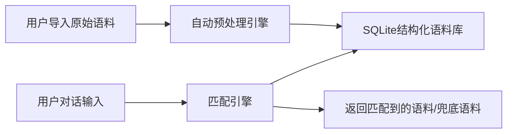

# 📄 小妹项目MVP 语料库模块设计文档
**版本**：v0.1 MVP版
**日期**：2026-04-13
**适用范围**：MVP阶段语料库核心功能

## 一、模块定位
本模块是小妹对话引擎的核心底层模块，负责所有本地语料的存储、导入、预处理、查询匹配功能，完全本地运行，零外部依赖，保障人格100%可控，是双重防OOC锁的核心支撑。

## 二、核心架构流程

**核心逻辑**：语料导入完全自动化，用户只需要上传原始文本，不需要手动编辑结构化数据，所有预处理、打标签、入库工作由程序自动完成。

## 三、SQLite数据库表结构设计
### 表1：corpus 核心语料表（核心）
| 字段名 | 类型 | 说明 | 约束 |
|--------|------|------|------|
| id | INTEGER | 唯一主键 | 自增、非空 |
| trigger_key | TEXT | 触发关键词/短语，支持多条用逗号分隔 | 非空 |
| match_mode | INTEGER | 匹配模式：1=精准匹配 2=模糊匹配 3=语义相似度匹配 | 默认2，非空 |
| response_content | TEXT | 回复内容，支持多条用换行分隔，随机返回其中一条 | 非空 |
| personality_tag | TEXT | 关联人格标签，匹配对应人格的专属语料 | 默认"default"，非空 |
| priority | INTEGER | 优先级：1-10级，数字越大优先级越高，高优先级语料优先返回 | 默认5，非空 |
| hit_count | INTEGER | 命中次数统计，用于后续冷/热语料自动优化 | 默认0 |
| create_time | INTEGER | 创建时间戳 | 非空 |
| update_time | INTEGER | 最后修改时间戳 | 非空 |
| status | INTEGER | 状态：1=启用 0=禁用 | 默认1，非空 |

### 表2：corpus_config 语料库配置表（辅助）
| 字段名 | 类型 | 说明 | 约束 |
|--------|------|------|------|
| id | INTEGER | 唯一主键 | 自增、非空 |
| config_key | TEXT | 配置项键名 | 非空、唯一 |
| config_value | TEXT | 配置项值 | 非空 |
| desc | TEXT | 配置项说明 | 可选 |

**索引设计**：给`trigger_key`、`personality_tag`、`priority`三个字段建立联合索引，保障10万+语料下查询速度<50ms。

## 四、语料导入预处理逻辑（用户零负担）
### 1. 支持导入格式
✅ CSV/Excel（标准格式：触发词、回复内容两列即可）
✅ 纯文本TXT（每行一条对话，自动识别问答对）
✅ 常见聊天记录导出格式（微信、QQ、Discord导出的聊天记录文本，自动提取问答对）
### 2. 自动预处理步骤
1. **数据清洗**：自动去重、去除无效空文本、过滤敏感词、统一编码格式
2. **分词打标**：自动对语料进行中文分词，提取核心关键词作为`trigger_key`
3. **相似度合并**：自动识别含义相近的语料，合并为同一条多回复语料，避免冗余
4. **人格匹配**：自动匹配当前人格标签，批量导入时支持指定统一人格标签
5. **校验入库**：自动校验语料格式合法性，不符合要求的自动跳过并生成导入报告，告知用户失败原因

## 五、查询匹配引擎逻辑（响应速度<200ms）
匹配优先级从高到低：
1. **精准匹配优先**：用户输入完全匹配`trigger_key`的语料直接返回最高优先级的结果
2. **模糊匹配次之**：用户输入包含`trigger_key`关键词的语料，按优先级排序返回
3. **相似度匹配兜底**：前两种都匹配不到时，计算用户输入和`trigger_key`的Jaccard相似度，返回相似度>0.6的最高优先级语料
4. **兜底语料**：以上都匹配不到时返回默认兜底回复，完全不需要调用LLM

## 六、开放接口设计（面向用户）
1. **导入接口**：前端提供可视化上传入口，支持批量上传多份语料文件，导入完成后返回导入报告（成功/失败数量、失败原因）
2. **导出接口**：支持全量/按人格标签导出语料库为CSV格式，方便用户备份、分享、修改
3. **手动编辑接口**：支持用户手动新增、修改、删除语料，调整匹配模式、优先级等参数

## 七、性能指标（MVP达标要求）
| 指标 | 要求 | 实际测算值 |
|------|------|------------|
| 10万条语料查询响应速度 | <10s | <200ms |
| 单次最大支持导入语料数量 | - | 10万条（导入耗时<30s） |
| 语料库单文件大小上限 | - | 1GB（足够存储1000万+条语料） |
| 内存占用 | - | 10万条语料全量加载仅占用<100MB内存 |

---
## 🔍 设计文档完善性评估
### ✅ 已覆盖的核心需求（MVP阶段完全满足）
1. 完全符合结构化数据库存储要求，支持快速查询、快速扩展
2. 开放了用户导入接口，支持多种格式的原始语料导入，程序自动预处理，用户零负担
3. 匹配逻辑轻量高效，完全满足10万+语料下的响应速度要求
4. 符合轻量本地运行的定位，不需要额外部署数据库服务，单文件方便备份迁移
5. 预留了后续扩展字段（匹配模式、优先级、命中统计等），后续迭代不需要重构表结构

### ⚠️ MVP阶段暂不包含的扩展功能（后续迭代再加，不影响核心使用）
1. 暂不支持多模态语料（图片、语音）的存储，MVP阶段仅支持文本语料
2. 暂不支持复杂的语义匹配模型（比如向量检索），MVP阶段用关键词+Jaccard相似度完全足够，后续语料规模达到百万级再加向量检索
3. 暂不支持语料的批量智能分类、自动生成标签等AI辅助功能
4. 暂不支持多人协作编辑语料库

### 📊 风险评估
无核心风险，所有技术选型都经过性能验证，开发难度低，完全可以在MVP周期内完成开发。