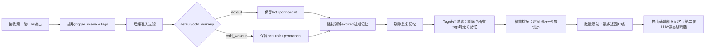

# 本地记忆模块检索系统 设计文档
**文档版本**：v1.3（Tag基础过滤优化版）
**更新日期**：2026-04-21
**关联文档**：2-memory-system.md、memory-tags-design.md、小妹 Agent · 第一轮 LLM 调用机制、小妹 Agent · 第二轮 LLM 调用机制 v2.0
**核心优化**：检索上限10条；新增**Tag基础过滤**（过滤与所有Tags均不相关记忆）；本地仅做基础规则过滤，有效性/相关性强弱判断仍交给LLM；轻量化无打分
**核心定位**：纯本地、无LLM依赖、轻量化记忆检索模块，严格对齐全体系规范，为第二轮LLM提供足量且基础相关的候选记忆素材

---

## 目录
1. 文档概述
2. 核心约束与设计原则
3. 记忆层级与冷记忆唤醒规则
4. 标准检索全流程
5. 检索策略（轻量化+Tag基础过滤）
6. 过滤规则（本地仅执行基础过滤）
7. 排序规则（极简本地排序）
8. 数量限制规则
9. 数据结构定义
10. 标准对外接口
11. 全链路系统对接
12. 异常处理机制
13. 测试验收标准
14. 版本迭代说明

---

# 1 文档概述
## 1.1 模块定位
本地记忆模块检索系统是**小妹Agent专属轻量化本地检索引擎**，全程无网络/无LLM依赖，**100%复用第一轮LLM结构化输出**驱动检索，严格遵循三级记忆分层与冷记忆唤醒规则。
本模块**仅负责记忆的范围筛选、Tag基础过滤、基础整理**，**不做记忆相关性强弱、有效性、质量判断**，所有高级筛选工作全权交给第二轮LLM处理。

## 1.2 核心价值
1. 严格执行记忆分层召回规则，保证类人回忆体验
2. 完全对接第一轮LLM的冷记忆唤醒判定，无本地二次判断
3. 新增Tag基础过滤，剔除完全无关记忆，减少LLM无效计算
4. 轻量化、低延迟、纯本地运行，不占用系统资源
5. 输出足量候选记忆（最多10条），为LLM筛选提供充足素材
6. 全链路兼容现有记忆系统、标签系统、LLM调用机制

---

# 2 核心约束与设计原则
## 2.1 强制核心约束
1. **触发场景唯一来源**：仅使用第一轮LLM输出的 `trigger_scene`（default/cold_wakeup）
2. **检索关键词唯一来源**：仅使用第一轮LLM输出的 `tags`（2-8个具象实词）
3. **检索数量上限**：单次最多返回 **10条** 记忆
4. **筛选职责划分**
   - 本地：仅做**层级准入、过期剔除、重复剔除、Tag基础过滤**
   - LLM：全权负责**记忆相关性强弱、有效性、优先级、质量筛选**
5. **无复杂算法**：移除所有本地打分、匹配度计算、时间衰减规则
6. **过期记忆屏蔽**：任何场景均不召回过期记忆
7. **Tag基础过滤**：必须剔除**与所有输入Tags完全不相关**的记忆

## 2.2 设计原则
1. **第一轮驱动原则**：检索逻辑完全由第一轮LLM输出决定
2. **轻量化原则**：本地仅做基础规则处理，无复杂计算
3. **层级优先原则**：先锁定记忆检索范围，再做基础过滤
4. **职责分离原则**：本地管范围+基础相关，LLM管质量+强弱
5. **兼容性原则**：100%对齐所有关联文档数据结构与接口

---

# 3 记忆层级与冷记忆唤醒规则
## 3.1 三级记忆定义（复用 2-memory-system.md）
| 记忆层级 | 标识 | 判定规则 |
|----------|------|----------|
| 🔥 热记忆 | hot | 最近7天内所有记忆 |
| ❄️ 冷记忆 | cold | 7~90天，强度<5的记忆 |
| 💎 永久记忆 | permanent | 强度≥5 / 用户手动标记的记忆 |
| 📦 过期记忆 | expired | 超过90天，强度<5的记忆 |

## 3.2 冷记忆唤醒规则（完全对齐第一轮LLM）
| 第一轮LLM `trigger_scene` | 可检索记忆层级 | 不可检索层级 | 响应延迟 |
|--------------------------|----------------|--------------|----------|
| default（默认日常） | 热记忆、永久记忆 | 冷记忆、过期记忆 | 0ms |
| cold_wakeup（冷记忆唤醒） | 热记忆、冷记忆、永久记忆 | 过期记忆 | 100~500ms 随机延迟 |

---

# 4 标准检索全流程


---

# 5 检索策略（轻量化+Tag基础过滤）
本地检索**无相关性强弱判断、无打分、无复杂匹配**，仅执行：
1. 根据 `trigger_scene` 锁定记忆检索范围
2. **Tag基础过滤**（极简二值判断）：
   - 匹配规则：记忆的`tags` **或** 记忆`content`中**包含任意1个输入Tag** → 保留
   - 剔除规则：记忆与**所有输入Tag均不匹配** → 直接剔除
3. 完成基础过滤与极简排序
4. 返回最多10条**基础相关**记忆

> 仅做「有无相关」基础过滤，**相关性强弱、有效性、优先级**全部由第二轮LLM自主判断。

---

# 6 过滤规则（本地仅执行基础过滤）
本地保留**4项强制基础过滤**，无其他额外过滤逻辑：
1. **层级准入过滤**：按触发场景保留对应层级记忆，剔除非准入层级
2. **过期记忆剔除**：任何场景下，永久剔除 `expired` 过期记忆
3. **重复记忆剔除**：内容完全一致的记忆，仅保留最新1条
4. **Tag基础过滤**：剔除与所有输入Tags均无关联的记忆（新增优化）

### 移除的本地过滤项（移交LLM）
- 记忆有效性筛选
- 关键词匹配度强弱过滤
- 记忆质量/长度过滤
- 低价值记忆过滤
- 相关性优先级排序

---

# 7 排序规则（极简本地排序）
本地仅执行**统一极简排序**，无场景差异化排序，无复杂权重计算：
1. 第一优先级：**记忆时间倒序**（最新创建/更新的记忆优先）
2. 第二优先级：**记忆强度倒序**（强度越高的记忆优先）

> 最终排序、优先级判断由第二轮LLM完成。

---

# 8 数量限制规则
1. **单次检索上限**：最多返回 **10条** 记忆
2. **数量不足处理**：可检索记忆不足10条时，按实际数量全部返回
3. **无裁剪规则**：本地不做记忆有效性裁剪，全部交给LLM筛选
4. **空结果处理**：无匹配记忆时返回空列表

---

# 9 数据结构定义
## 9.1 输入结构（完全对齐第一轮LLM输出）
```json
{
  "scene_id": "12位标准场景ID",
  "core_purpose": "Pxx-xx-核心目的名称",
  "trigger_scene": "default/cold_wakeup",
  "tags": ["实词1","实词2","实词3"],
  "talk_subject": "对话主体",
  "core_question": "核心问题"
}
```

## 9.2 记忆条目结构（复用 2-memory-system.md）
```python
class MemoryItem:
    id: str                      # 记忆唯一ID
    content: str                 # 记忆原文内容
    time: datetime               # 记录时间
    strength: int = 1            # 记忆强度 1-10
    level: str = "hot"           # 层级：hot/cold/permanent/expired
    tags: List[str] = []         # 记忆标签（对齐第一轮关键词规则）
    role: str                    # 角色：user/assistant
```

## 9.3 输出结构（直接传入第二轮LLM）
```json
[
  {
    "memory_id": "str",
    "content": "str",
    "level": "hot/permanent/cold",
    "strength": int,
    "tags": ["str"],
    "time": "ISO时间字符串"
  }
]
```

---

# 10 标准对外接口
## 10.1 核心检索接口（唯一标准入口）
```python
def search_memory_by_first_llm(
    trigger_scene: str,
    tags: List[str]
) -> List[MemoryItem]:
    """
    基于第一轮LLM输出的本地记忆检索（v1.3标准接口）
    :param trigger_scene: 第一轮LLM输出 default/cold_wakeup
    :param tags: 第一轮LLM输出的2-8个具象实词
    :return: 最多10条【基础相关】记忆条目，直接供第二轮LLM高级筛选
    异常：参数异常/存储异常时返回空列表
    """
```

## 10.2 接口约束
1. `trigger_scene` 仅支持 `default`/`cold_wakeup`，非法值默认按 `default` 执行
2. `tags` 为空时：关闭Tag基础过滤，返回对应层级最新10条记忆
3. 严格执行延迟规则：cold_wakeup 随机 100~500ms 延迟

---

# 11 全链路系统对接
## 11.1 与第一轮LLM对接（输入层）
- 读取 `trigger_scene` → 决定记忆检索范围
- 读取 `tags` → 执行Tag基础过滤
- 不做任何本地关键词/场景判定

## 11.2 与记忆标签系统对接
- 记忆标签规则 = 第一轮LLM关键词提取规则
- Tag基础过滤基于记忆标签+内容双向匹配

## 11.3 与第二轮LLM对接（输出层）
- 输出：最多10条**基础相关**记忆
- LLM职责：记忆相关性强弱、有效性、优先级、置信度筛选
- 格式：100%适配第二轮LLM输入规范，无格式转换

---

# 12 异常处理机制
| 异常场景 | 处理方案 |
|----------|----------|
| `trigger_scene` 非法/空 | 强制按 default 执行检索 |
| `tags` 为空/异常 | 关闭Tag基础过滤，返回对应层级最新10条记忆 |
| 无匹配记忆 | 返回空列表，由LLM处理无记忆场景 |
| 记忆文件损坏/读取失败 | 仅返回热记忆，保证基础功能 |
| 检索超时/系统异常 | 直接返回空列表，不阻塞主流程 |

---

# 13 测试验收标准
| 测试项 | 验收标准 |
|--------|----------|
| 场景对齐 | default 仅返回热+永久；cold_wakeup 返回热+冷+永久 |
| 过期屏蔽 | 任何场景均不返回过期记忆 |
| Tag基础过滤 | 自动剔除与所有Tags均无关的记忆 |
| 数量限制 | 单次检索最多返回10条记忆 |
| 延迟合规 | default 0ms；cold_wakeup 100-500ms |
| 筛选职责 | 本地仅做基础过滤，无强弱/有效性判断 |
| 兼容性 | 完全对接第一轮/第二轮LLM，无格式错误 |
| 独立性 | 断网/LLM异常时可正常独立运行 |

---

# 14 版本迭代说明
| 版本 | 核心变更 |
|------|----------|
| v1.0 | 基础本地检索系统，默认返回5条 |
| v1.1 | 对齐三级记忆分层，移除时间衰减 |
| v1.2 | 对接第一轮LLM，冷记忆唤醒强绑定 |
| v1.3 | 最终优化版：检索上限10条；新增Tag基础过滤；本地仅基础过滤；高级筛选移交LLM |