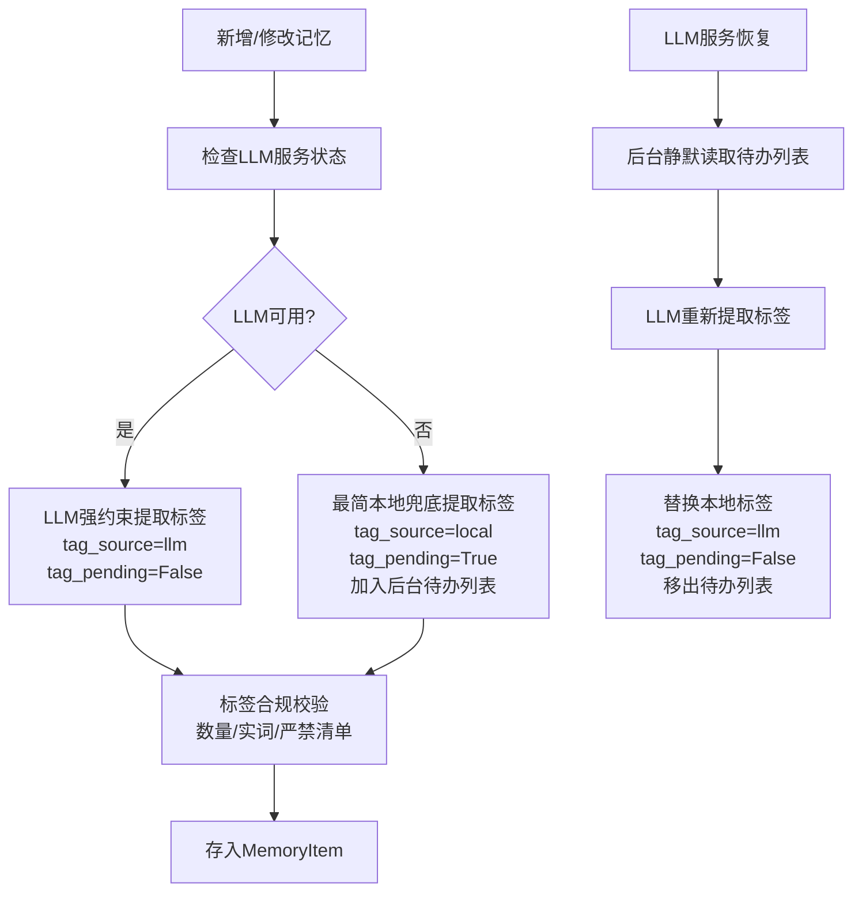

# 模块详细设计：记忆标签（Tags）定义与生成规范
**版本：** v1.2
**日期：** 2026-04-21
**核心新增特性**：LLM强约束对齐机制 + 最简本地兜底提取 + 标签静默更新补偿机制
**模块定位**：本地记忆与归纳模块标签体系标准化设计，**100%强制对齐第一轮LLM关键词规则**；支持LLM异常时极简本地兜底、自动标记待更新，LLM恢复后后台静默替换修复，全兼容现有记忆MVP架构
**遵循原则**：继承《2-memory-system.md》全配置化、模块化可插拔要求；标签规则无自定义、无扩展，完全复用第一轮LLM标准

---

## 📋 模块概述
记忆标签（Tags）是记忆模块核心检索单元，**全流程严格绑定「小妹 Agent · 第一轮 LLM 调用机制」关键词规则**：
1. **LLM可用时**：强制调用LLM提取标签，规则/定义/约束与第一轮LLM**完全一致、无任何偏差**；
2. **LLM异常时**：启用**最简本地兜底提取**，严格遵守第一轮关键词约束，自动标记标签来源、加入后台待办列表；
3. **LLM恢复后**：后台**静默执行LLM标签重提取**，无缝替换本地兜底标签，保证全量标签最终统一为LLM标准格式。

本设计零侵入原有记忆架构，仅扩展标签生成、补偿逻辑，不修改存储/检索/分级核心流程。

---

## 🔧 核心设计
### 1. 数据结构定义（轻量扩展，100%兼容原MemoryItem）
在原有`MemoryItem`基础上，**新增2个轻量标签元字段**（非破坏性修改，兼容旧数据），用于标记来源与待更新状态：
```python
class MemoryItem:
    id: str                      # 唯一ID（原有）
    content: str                 # 记忆内容（原有）
    time: datetime               # 记录时间（原有）
    strength: int = 1            # 记忆强度1-10（原有）
    level: str = "hot"           # 记忆层级：hot/cold/permanent/expired（原有）
    tags: List[str] = []         # 记忆标签（标准实词，原有）
    role: str                    # 对话角色：user/assistant（原有）
    # -------- 新增轻量标签元字段（兼容旧数据，默认值自动填充）--------
    tag_source: str = "llm"      # 标签来源：llm=LLM提取 / local=本地兜底提取
    tag_pending: bool = False    # 标签待静默更新：True=待LLM修复 / False=已完成
```

### 2. 记忆标签官方定义与规则（**100%强制复用第一轮LLM关键词规则，无修改**）
### 2.1 标签核心定义
**记忆标签 = 从记忆内容中提取的标准关键词**
标签必须是以**名词、动词、形容词**为主的**主体类实词**，可直接串联归纳对话/记忆的主要语义。

### 2.2 标签提取核心原则（强制约束，LLM/本地提取均遵守）
- 标签必须是**记忆内容中真实存在的具体实词**（人、事、物、动作、状态、物品、行为等）
- 严禁提取：时间段、日期属性、用户场景、情绪、主题等类别/概念/抽象词
- 6个维度仅作为思考角度，不输出维度名称
- 数量：**2–8 个**，全部为具象实词
- 来源：仅从当前记忆内容提取，**不编造、不引申、不归类**

### 2.3 标签提取思考角度（LLM/本地提取通用）
1. 时间角度：具体时间/时刻相关实词
2. 场景角度：具体地点/环境相关实词
3. 人物角度：具体人物/角色相关实词
4. 行为角度：具体动作/行为相关实词
5. 事物角度：具体物品/内容相关实词
6. 目的角度：具体目的/诉求相关实词

### 2.4 标签严禁清单（零例外，LLM/本地提取均遵守）
禁止：任何类别、概念、抽象、维度名称词语
禁止：引申、归类、概括、总结性词语

---

### 3. 双轨标签生成核心流程（标准执行链路）


---

### 4. LLM强约束标签生成机制（主轨，100%对齐第一轮LLM）
#### 4.1 适用场景
LLM服务正常、无超时、无调用异常时**唯一执行方案**

#### 4.2 核心约束
1. **Prompt完全复用**：直接使用「小妹Agent第一轮LLM」关键词提取Prompt，不修改任何文字；
2. **输出格式完全一致**：仅返回2-8个具象实词，JSON/逗号分隔格式与第一轮对齐；
3. **校验规则完全一致**：通过第一轮异常判定规则校验标签，违规则重新调用。

#### 4.3 LLM调用Prompt（直接复用第一轮，强制标准）
```
你正在执行【记忆标签提取】任务，**严格遵守小妹Agent第一轮LLM关键词提取所有规则**：
1. 标签必须是记忆内容中真实存在的具体实词（名词/动词/形容词）
2. 提取数量：2-8个，不超量、不缺量
3. 严禁提取：时间段、日期属性、用户场景、情绪、主题等类别/抽象词
4. 严禁：编造、引申、归类、概括、总结
5. 仅输出标准数组格式，无任何多余文字

【记忆内容】
{content}

【输出格式】
["标签1","标签2","标签3"]
```

#### 4.4 执行规则
- 温度：0.1（极低随机性，保证与第一轮结果一致）
- 重试：LLM返回违规标签，自动重试1次
- 结果：校验通过后存入`tags`，标记`tag_source=llm`，无需待更新

---

### 5. 最简本地兜底提取机制（备用轨，极简实现，严格遵守约束）
#### 5.1 适用场景
LLM调用超时、服务异常、无响应、返回格式错误时**自动触发**

#### 5.2 设计原则：最简、轻量、无依赖、严格对齐规则
- 无复杂算法、无语义分析、无权重计算
- 仅做**中文分词 + 实词筛选**
- 所有约束与第一轮LLM完全一致

#### 5.3 本地提取执行步骤（极简4步）
1. **原文分词**：使用轻量中文分词工具（jieba/内置分词）拆分记忆原文；
2. **实词过滤**：仅保留**名词、动词、形容词**，剔除虚词、标点、停用词；
3. **规则校验**：剔除抽象/类别词、保留原文真实存在的词，控制数量2-8个；
4. **结果标记**：存入`tags`，标记`tag_source=local`、`tag_pending=True`，加入待办列表。

#### 5.4 本地提取严禁行为（零例外）
- 不生成概括词、不引申语义、不归类、不抽象
- 不添加任何系统占位符（无结果则返回空数组`[]`）

---

### 6. 标签静默更新补偿机制（核心：自动修复本地标签）
#### 6.1 标签待办列表
- 存储格式：内存队列 + 持久化日志（兼容现有记忆存储）
- 存储内容：`记忆ID、记忆内容、本地标签、创建时间`
- 清理规则：LLM修复完成后自动移出，保留7天日志

#### 6.2 静默更新触发条件
满足任一即可自动执行：
1. LLM服务状态从**异常恢复为正常**
2. 系统空闲时段（低负载时）
3. 待办列表数量≥10条

#### 6.3 静默更新执行规则
1. **后台异步执行**：不影响主对话流程，无感知、无弹窗；
2. **严格复用LLM主轨规则**：用第一轮标准Prompt重提取标签；
3. **无缝替换**：覆盖原有`tags`，更新`tag_source=llm`、`tag_pending=False`；
4. **失败处理**：更新失败则保留待办状态，下次重试。

---

### 7. 标签管理与检索规则（全兼容原有系统）
#### 7.1 检索规则（无修改）
- 标签来源不影响检索：LLM/本地标签参与同等权重检索
- 匹配规则：原生实词精准匹配，与第一轮关键词检索一致

#### 7.2 管理命令（扩展原有命令，无新增学习成本）
| 命令 | 功能 |
|------|------|
| `/xiaomei memory tag list` | 查看记忆标签+来源（llm/local） |
| `/xiaomei memory tag pending` | 管理员查看标签待更新列表 |
| `/xiaomei memory tag refresh` | 手动触发静默更新（管理员） |

---

## 🔌 接口扩展（轻量新增，兼容原有接口）
### 1. 静默更新标签（后台异步接口）
```python
def silent_update_tags() -> int:
    """
    后台静默更新所有待办标签（LLM提取替换本地提取）
    返回：更新完成的记忆数量
    """
```

### 2. 检查LLM状态（内部接口）
```python
def check_llm_health() -> bool:
    """
    检查LLM服务是否可用
    返回：True=可用 / False=异常
    """
```

### 3. 扩展原有add_memory（自动生成标签）
```python
def add_memory(content: str, role: str) -> str:
    """
    新增记忆 → 自动执行双轨标签生成 → 自动标记来源/待办
    返回：记忆ID
    """
```

---

## ⚠️ 全场景异常与容错处理
| 异常场景 | 处理方式 |
|----------|----------|
| LLM调用超时/异常 | 自动切换本地兜底，标记待更新 |
| 本地提取无有效实词 | 标签设为`[]`，仍标记待LLM修复 |
| 静默更新时LLM再次异常 | 保留待办状态，下次重试 |
| 标签数量违规（<2/>8） | 自动补齐/截断，严格遵守2-8个约束 |
| 记忆存储异常 | 不影响记忆主体，标签置空 |

---

## ✅ 测试验收标准
| 测试项 | 验收标准 |
|--------|----------|
| LLM一致性 | LLM生成标签与第一轮LLM关键词结果100%对齐 |
| 兜底合规性 | 本地提取标签严格遵守所有规则，无违规内容 |
| 标记准确性 | 本地标签自动标记`local+pending`，LLM标签正常 |
| 静默更新 | LLM恢复后，自动替换所有待办标签，无感知 |
| 流程健壮性 | LLM切换不影响记忆存储、对话流程 |
| 兼容性 | 旧记忆数据自动填充默认标签元字段，无报错 |

---

### 📌 核心实现说明
1. **绝对统一**：LLM提取规则=第一轮LLM关键词规则=本地兜底规则，全链路无偏差；
2. **极简兜底**：本地提取仅做分词+实词筛选，无复杂逻辑，轻量无依赖；
3. **无感修复**：静默更新在后台执行，不干扰用户对话，最终全量标签标准化；
4. **零侵入架构**：仅新增2个轻量字段，不修改《2-memory-system.md》核心逻辑；
5. **可监控**：支持查看标签来源、待办列表，方便运维管理。

---
**设计人：** 小云☁️
**日期：** 2026-04-21
**状态：** 📋 待实现