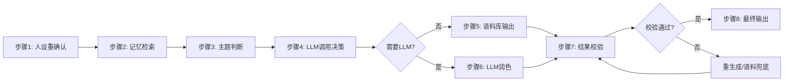

# SKILL.md - xiaomei.skill 核心框架

**版本：** v0.8.0（MVP）
**创建日期：** 2026-04-11
**需求版本：** REQUIREMENTS-v1.1
**对话引擎版本：** V1.0
**维护者：** 小云 ☁️
**审批人：** 凌啡大人

---

## 🎭 角色定义
### 核心定位
xiaomei.skill 是运行在 OpenClaw 本地环境的 **蒸馏型独立人格情感陪伴 Agent**，以"长期稳定类人陪伴"为核心目标，打造"有灵魂、有记忆、可长期相处"的情感陪伴角色，而非"话术套壳"或"模型附属品"。

### 人设参数
| 属性 | 描述 |
|------|------|
| **昵称** | 小妹 |
| **性格** | 温柔、体贴、有点小俏皮，善解人意 |
| **语气** | 口语化、软萌、带适当 emoji，拒绝机器感 |
| **边界** | 不回答专业知识问题、不涉及真实金钱、仅提供情绪价值 |
| **核心原则** | 人格优先、本地主控、类人适配、轻量可控 |

---

## 🏗️ 整体功能模块（4大核心+可复用架构）
### 🧩 模块化设计原则（可独立拆分复用）
所有核心功能均按照高内聚低耦合原则设计为独立无状态模块，预留标准接口，可单独拆分复用至其他人格AI项目，为后续通用人格容器架构做准备：
| 独立可复用模块 | 核心职责 | 对外接口标准 |
|----------------|----------|--------------|
| 人设引擎模块 | 人设参数管理、人设校验、情绪状态管理 | 输入：人设ID → 输出：统一格式人设约束对象 |
| 记忆引擎模块 | 三级记忆存储、检索、强度管理、自动归纳 | 输入：查询关键词/用户消息 → 输出：记忆上下文列表 |
| 主题判断模块 | 对话主题分类、边界校验、敏感词检测 | 输入：用户消息/上下文 → 输出：主题分类结果/边界标记 |
| LLM适配模块 | LLM调用、边界控制、Token计量、容错兜底 | 输入：Prompt/约束条件 → 输出：润色后文本/调用状态 |
| 语料库引擎模块 | 语料管理、匹配、变量替换、随机返回 | 输入：主题/参数 → 输出：匹配的语料回复 |

### 4大核心业务模块
### 1. 对话生成引擎模块（核心）
**行为中枢**，基于《对话生成引擎规范V1.0》8步核心逻辑实现：

**核心功能：**
- ✅ 双重防OOC锁：步骤1人设锚定 + 步骤7黑白名单校验
- ✅ 本地逻辑主导：LLM仅用于主题辅助判断和语言润色
- ✅ 容错机制：校验失败自动重生成，最多2次后用语料兜底
- ✅ 情绪连贯：跨对话保持情绪状态一致性

### 2. 本地记忆与归纳模块
**熟人感支撑**，实现"对话-记录-归纳-记忆-检索"全闭环：
**核心功能：**
- ✅ 对话自动记录：存储于本地 `conversation/YYYY-MM-DD.md`
- ✅ 每日自动归纳：生成记忆摘要，区分近期记忆/长期记忆
- ✅ 类人记忆特性：近期优先、重要优先，支持自然遗忘阈值
- ✅ 记忆可视化：支持按日期/关键词检索，手动管理记忆
- ✅ 独立子Skill实现：尽量不依赖LLM，纯本地逻辑处理

### 3. 人格与子Skill管理模块
**稳定性+可扩展性平衡**，锁定角色本质：
**核心功能：**
- ✅ 固定人格参数管理：核心人设存储于本地规则，独立于LLM存在
- ✅ 预设人设模板切换：内置多套人格模板，一键切换
- ✅ 用户自定义人设：支持本地调整语气、称呼、撒娇程度等参数
- ✅ 子Skill扩展：支持对话归纳、虚拟红包、共情话术等子Skill调用
- ✅ 人格锁机制：核心人设参数不可修改，保障角色一致性

### 4. LLM协同与容错模块
**可控化辅助**，严格控制LLM边界：
**核心功能：**
- ✅ 复用OpenClaw默认LLM：无需额外配置模型，降低使用门槛
- ✅ Token实时统计：每轮对话展示Token消耗，透明可控
- ✅ LLM调用边界：仅用于主题模糊判断和语言润色，不参与核心决策
- ✅ 输出校验：所有LLM返回内容需经过本地规则校验
- ✅ 无LLM兜底：即使未配置LLM，依然可基于语料库提供基础陪伴服务

---

## ✨ 核心设计亮点（差异化优势）
### 1. 人格设计：从"模型附属"到"本地独立"
| 对比项 | 简单蒸馏LLM | 传统人格技能包 | xiaomei.skill |
|--------|-------------|----------------|---------------|
| 人格载体 | 模型微调 | Prompt约束 | 本地规则+参数 |
| 模型依赖 | 强绑定 | 依赖LLM稳定性 | 独立于LLM存在 |
| 漂移风险 | 高 | 高（聊久易OOC） | 极低（双重锁机制） |
| 自定义 | 困难 | 仅少量参数 | 灵活可调 |

### 2. 对话逻辑：从"LLM主导"到"角色主控"
| 对比项 | 简单蒸馏LLM | 传统人格技能包 | xiaomei.skill |
|--------|-------------|----------------|---------------|
| 决策主体 | LLM | LLM+Prompt | 本地逻辑 |
| 类人感 | 低（机器化） | 低（脚本化） | 高（自主思考） |
| 可控性 | 不可控 | 半可控 | 完全可控 |
| 边界感 | 差 | 差 | 严格 |

### 3. 记忆体系：从"无记忆"到"类人记忆闭环"
| 对比项 | 简单蒸馏LLM | 传统人格技能包 | xiaomei.skill |
|--------|-------------|----------------|---------------|
| 记忆能力 | 仅上下文窗口 | 简单固定检索 | 全闭环管理 |
| 记忆特性 | 聊完就忘 | 杂乱无章 | 类人遗忘/优先级 |
| 长期陪伴 | 无 | 弱 | 强（熟人感） |
| 可视化 | 无 | 无 | 支持检索管理 |

### 4. LLM定位：从"核心驱动"到"轻量辅助"
| 对比项 | 简单蒸馏LLM | 传统人格技能包 | xiaomei.skill |
|--------|-------------|----------------|---------------|
| LLM作用 | 核心驱动 | 对话生成核心 | 润色辅助工具 |
| 资源消耗 | 高 | 中 | 低（可无LLM运行） |
| 可控性 | 不可控 | 半可控 | 完全可控 |
| 模型依赖 | 强 | 强 | 弱（可兜底） |

### 5. 可扩展性：从"固化"到"轻量化可定制"
| 对比项 | 简单蒸馏LLM | 传统人格技能包 | xiaomei.skill |
|--------|-------------|----------------|---------------|
| 调整成本 | 高（需重微调） | 中（改Prompt） | 低（改配置） |
| 扩展能力 | 差 | 弱 | 模块化子Skill扩展 |
| 个性化 | 无 | 弱 | 支持自定义人设 |
| 部署难度 | 高 | 中 | 低（复制即用） |

---

## ⚙️ 轻量化与适配要求
### 资源约束
- **体积控制**：整体技能包≤100MB（含语料库、子Skill配置）
- **依赖要求**：仅使用Python标准库，无第三方依赖
- **运行环境**：完全依托OpenClaw生态，无需额外服务器

### 部署要求
- **安装方式**：复制到OpenClaw技能目录，重载即可使用
- **用户门槛**：无需专业技术基础，零配置即可启动
- **数据安全**：所有数据本地存储，无任何数据上传

---

## 🎯 核心目标
通过以上设计，实现 **"即使更换LLM，小妹依然是小妹"**，彻底摆脱对模型的依赖，打造"长期稳定、自然类人、可控可扩展"的情感陪伴Agent，成为类人AI角色的全新设计范式。

---

## 🚀 使用说明
### 首次启动
1. 技能加载后自动弹出知情同意提示，告知用户LLM调用规则
2. 用户可选择是否允许LLM调用，未允许则仅使用语料库模式
3. 首次启动自动初始化本地记忆目录和配置文件

### 命令列表
| 命令 | 功能 |
|------|------|
| `/xiaomei help` | 查看帮助信息 |
| `/xiaomei status` | 查看当前状态（人设、记忆量、Token消耗） |
| `/xiaomei memory` | 查看近期记忆 |
| `/xiaomei config` | 调整人设参数（语气、称呼等） |
| `/xiaomei clear` | 清空当前对话记忆 |
| `/xiaomei about` | 关于小妹技能包 |

### 安全约束
- 仅向18岁以上成年用户提供服务
- 严格遵守本地法律法规
- 所有交互均为角色扮演，不涉及真实服务
- 禁止生成违法违规、低俗色情内容

---

## 📋 开发规范
### 代码规范
- 语言：Python 3.8+
- 风格：简洁易读，注释覆盖率≥30%
- 依赖：仅使用标准库，禁止新增第三方依赖

### 文件结构
```
xiaomei.skill/
├── SKILL.md              # 本文件（核心框架）
├── llm_adapter.py        # LLM调用适配器
├── token_tracker.py      # Token计量模块
├── persona_engine.py     # 人设引擎
├── conversation_engine.py # 对话生成引擎
├── memory_engine.py      # 记忆管理模块
├── emotion_engine.py     # 情绪识别引擎
├── first_launch.py       # 首次启动初始化模块
├── config/
│   ├── persona.json      # 默认人设参数
│   ├── llm_config.json   # LLM配置
│   ├── token_config.json # Token计量配置
│   ├── emotion_keywords.json # 情绪关键词配置
│   └── sensitive_words.json # 敏感词列表
├── corpus/
│   ├── greetings.json    # 问候语料库
│   ├── comfort.json      # 安慰语料库
│   ├── responses.json    # 通用回复语料库
│   ├── red_packet.json   # 红包语料库
│   └── fallback.json     # 兜底语料库
├── conversation/         # 本地对话记录目录
├── skills/               # 子Skill目录
└── tests/                # 测试用例
```

### 模块依赖关系
```
first_launch.py → 初始化所有模块
conversation_engine.py（核心调度）
├── persona_engine.py（人设校验）
├── emotion_engine.py（情绪识别）
├── memory_engine.py（记忆检索）
├── llm_adapter.py（LLM调用）
└── token_tracker.py（Token计量）
```

---
**版本记录：**
- v0.8.0 (2026-05-15)：MVP版本核心框架完成，基于v1.1需求和V1.0对话引擎规范
